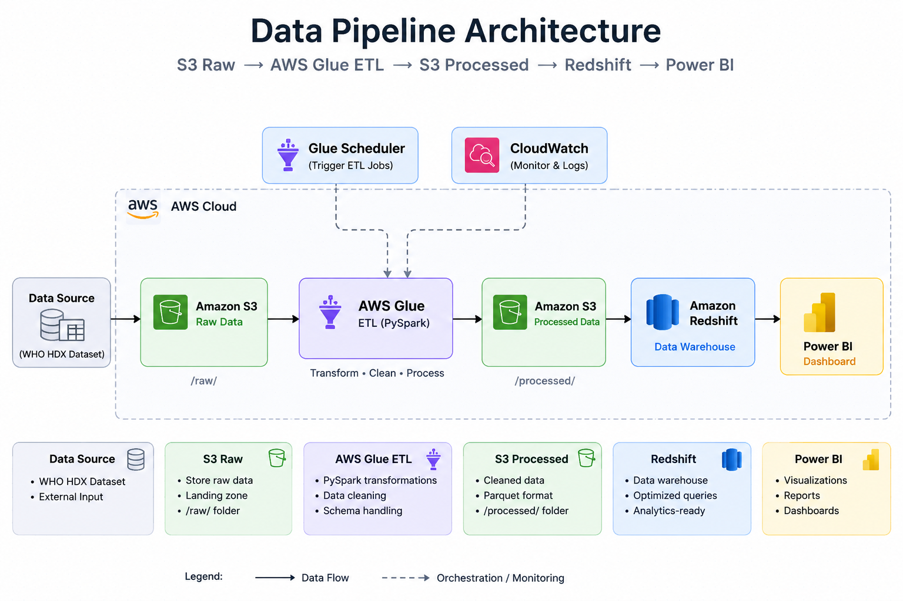
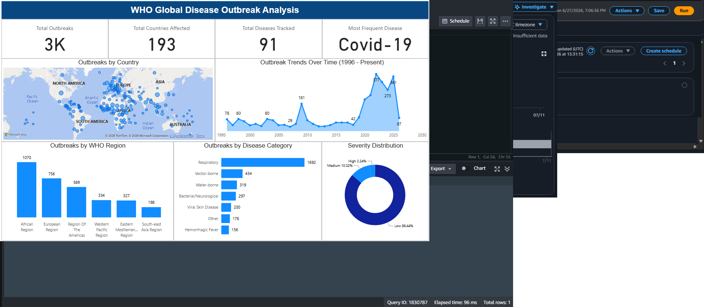
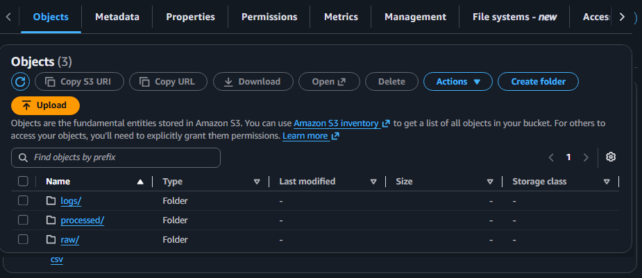
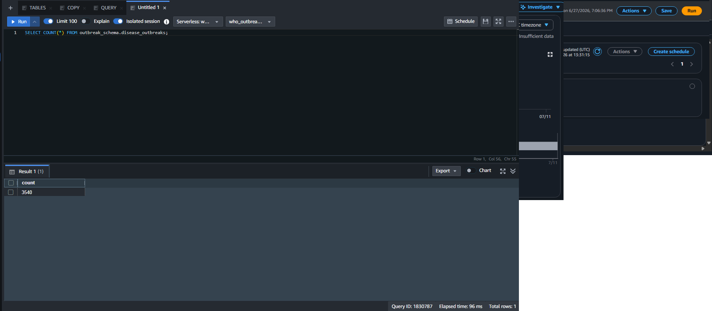
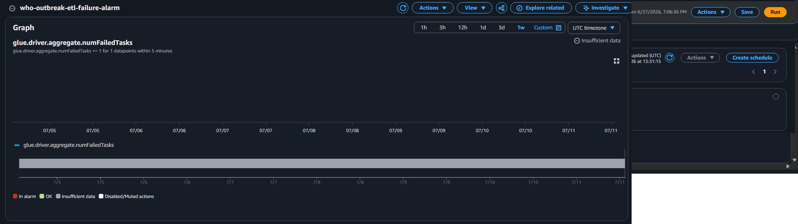
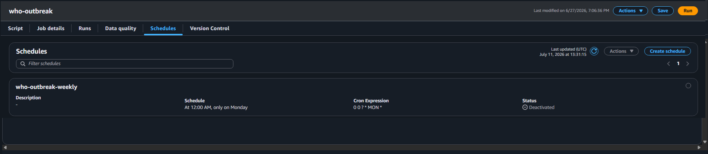

# WHO Global Disease Outbreak Data Pipeline

An end-to-end AWS data engineering pipeline that ingests, transforms, and visualizes WHO global disease outbreak data spanning 1996 to present.

---

## Dashboard Preview

---

## Project Overview

This project builds a production-like data pipeline using AWS cloud services to process WHO HDX disease outbreak data covering 3,500+ outbreaks across 90+ diseases and 236 countries. The pipeline automatically ingests raw data, applies PySpark transformations, loads cleaned data into a Redshift data warehouse, and visualizes insights through a Power BI dashboard.

---

## Tech Stack

| Layer | Tool |
|---|---|
| Storage | Amazon S3 |
| Processing | AWS Glue (PySpark) |
| Data Warehouse | Amazon Redshift Serverless |
| Visualization | Microsoft Power BI |
| Scheduling | AWS Glue Scheduler |
| Monitoring | Amazon CloudWatch |
| Language | Python, SQL |

---

## Pipeline Architecture

WHO HDX Dataset
&nbsp;&nbsp;&nbsp;&nbsp;↓
Amazon S3 (raw/) — landing zone for raw CSV
&nbsp;&nbsp;&nbsp;&nbsp;↓
AWS Glue ETL (PySpark) — transform, clean, enrich
&nbsp;&nbsp;&nbsp;&nbsp;↓
Amazon S3 (processed/) — cleaned Parquet files
&nbsp;&nbsp;&nbsp;&nbsp;↓
Amazon Redshift — data warehouse
&nbsp;&nbsp;&nbsp;&nbsp;↓
Power BI Dashboard — visualizations
&nbsp;&nbsp;&nbsp;&nbsp;↓
Glue Scheduler — weekly automation
CloudWatch — failure alerts

---

## Dataset

**Source:** WHO HDX Global Disease Outbreak Dataset
**Link:** https://data.humdata.org/dataset/global-pandemic-and-epidemic-outbreaks
**Coverage:** 3,500+ outbreaks | 90+ diseases | 236 countries | 1996 - Present
**Diseases include:** COVID-19, Cholera, Ebola, Monkeypox, Dengue, Measles, and more

---

## Transformations Applied

All transformations were done using PySpark in AWS Glue:

- Removed HXL metadata rows from raw dataset
- Dropped unnecessary ICD code columns
- Standardized column names to lowercase with underscores
- Filled null values in non-critical columns
- Standardized country, disease, and region names to title case
- Cast year column from string to integer
- Added `disease_category` column using regex pattern matching
- Added `year_bucket` column grouping outbreaks into 5-year periods
- Added `outbreak_severity` column (High / Medium / Low)
- Saved output as Parquet format for optimized querying

---

## Data Model

### Table: `outbreak_schema.disease_outbreaks`

| Column | Type | Description |
|---|---|---|
| id_outbreak | VARCHAR(50) | Unique outbreak identifier |
| year | INTEGER | Year of outbreak |
| disease | VARCHAR(100) | Disease name |
| definition | VARCHAR(5000) | WHO case definition |
| country | VARCHAR(100) | Country name |
| iso3 | VARCHAR(10) | ISO 3-letter country code |
| unsd_region | VARCHAR(100) | UN regional grouping |
| unsd_subregion | VARCHAR(100) | UN sub-regional grouping |
| who_region | VARCHAR(100) | WHO regional office |
| disease_category | VARCHAR(50) | Categorized disease type |
| year_bucket | VARCHAR(20) | 5-year time period grouping |
| outbreak_severity | VARCHAR(10) | High / Medium / Low |

### View: `outbreak_schema.vw_outbreak_summary`

Aggregated view used by Power BI showing outbreak counts by disease, country, region, year and severity.

---

## Dashboard Insights

- **4K+** total outbreaks tracked
- **236** countries affected
- **92** unique diseases
- **COVID-19** is the most frequent disease
- **African Region** has the highest outbreak count
- **Respiratory diseases** dominate by category
- Clear **spike in outbreaks post-2020**

---

## Project Structure

- **glue/** — who_outbreak_etl.py (PySpark ETL script)
- **redshift/** — create_table.sql, copy_command.sql, create_view.sql
- **architecture/** — pipeline_architecture.png
- **screenshots/** — 01 through 06, showing each stage of the pipeline
- **README.md**

---

## Setup Instructions

### Prerequisites
- AWS Account
- AWS CLI configured
- Power BI Desktop

### 1. S3 Setup
Create an S3 bucket with three folders: `raw/`, `processed/`, and `logs/`. Upload the WHO HDX dataset CSV to `raw/`.

### 2. IAM Setup
Create an IAM role for Glue with these policies:
- `AmazonS3FullAccess`
- `AWSGlueServiceRole`

Create an IAM role for Redshift with:
- `AmazonS3ReadOnlyAccess`

### 3. Glue ETL Job
- Create a Glue job using Script Editor
- Use Glue 4.0 with PySpark
- Copy the script from `glue/who_outbreak_etl.py`
- Update the S3 bucket paths to your bucket name

### 4. Redshift Setup
Run SQL files in order:
1. `redshift/create_table.sql`
2. `redshift/copy_command.sql`
3. `redshift/create_view.sql`

### 5. Power BI
- Connect Power BI Desktop to Redshift
- Use `vw_outbreak_summary` view
- Publish to Power BI Service

### 6. Scheduling and Monitoring
- Set up Glue Scheduler for weekly runs
- Create CloudWatch alarm on `glue.driver.aggregate.numFailedTasks`

---

## Key Design Decisions

**Why Parquet over CSV?**
Parquet is a columnar format that reduces storage size and improves query performance in Redshift. It is the industry standard for data lakes.

**Why Redshift Serverless?**
No cluster management needed. Only charges when queries are running — cost effective for a portfolio project and easy to scale in production.

**Why PySpark in Glue?**
Glue natively supports PySpark which allows distributed processing. For larger datasets this scales horizontally without code changes.

**Why a View for Power BI?**
The view abstracts the underlying table structure from Power BI. If the table schema changes, only the view needs updating — not the Power BI report.

**Security note**
In production, Redshift inbound rules would be restricted to Power BI Service IP ranges instead of being open to 0.0.0.0/0.

---

## Screenshots

### S3 Bucket Structure

### Glue Job Success

### Redshift Row Count

### CloudWatch Alarm

### Glue Schedule

### Power BI Dashboard

---

## Author

**Kiel** 
📧 kielctalampas@email.com
🔗 linkedin.com/in/ezekielctalampas
🐙 github.com/kieltalampas
